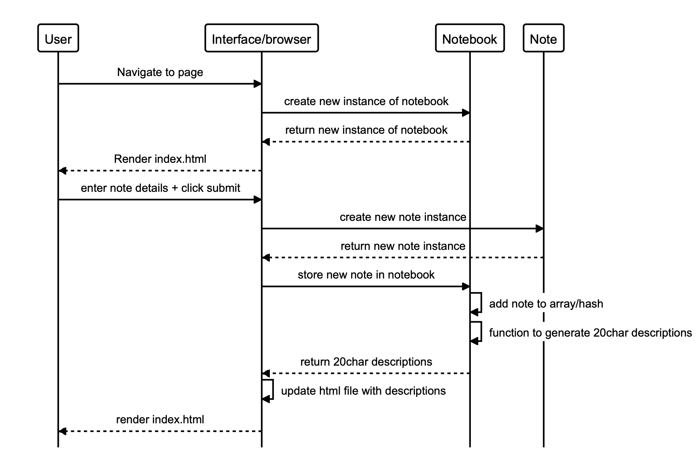

# Group project - Notes

A single page front end vanilla javascript app for note taking, this project was developed as a group.

### Project challenges

* To create a web app that only uses a single page.
* To do so without using any external libraries, such as jQuery or Jasmine.
* To develop the app in a TDD way.

### User stories

```
As a programmer
I can see a list of my notes, where each note is abbreviated to the first 20 characters
So I can find the one I want
```
```
As a programmer
I can create a new note
So I can record something I need to remember
```
```
As a programmer
I can see the full text of an individual note on its own page
So I can see all the information in the note
```
```
As a programmer
I can use shortcodes like `:fire:` that get converted into emojis like 🔥
So I can record notes with fun little pictures
```
## How to use

-The app loads in the view for adding a note and viewing the note list as a default. When notes are added, an abbreviated version is added to the notes list which appears below the text box. Each abbreviation acts as a link to the note view, where the full text of the note can be seen.
-You can include emojis in notes by using shortcodes. These are converted into emojis via the Makers emojify API.

## Tests

* The javascript folder is divided into src and spec folders. 
* To run the tests, open tests.html from the javascript folder in your browser. This loads and runs both the src and spec files.
* Open the console to view pass and fail messages for the tests.

## Process

-We began by writing javascript classes we felt would be needed to meet the needs of the program. This included a notebook class, which we ended up not needing as the same could be achieved by storing the notes to a list within the array.
-We also diagrammed our initial thoughts on how the interface would work.
-We then wrote unit tests for these classes - these were very basic to begin with, simply if/else conditionals printing to the console.
-We then worked on the interface individually, to meet the first 3 user stores, so everyone could practice with vanilla javascript, and came back to pull our versions together.
-We then worked in pairs on developing the testing framework and integrating the API.
-We worked together to finish off the testing, to deploy the app, and to integrate storing notes to local storage, both of which were additional goals to the user stories.
-Having fully met the brief, we then worked individually on implementing styling and further functionality.

## Diagrams



#### diagrams.codes code for this diagram:


```
alias u="User"
alias i="Interface/browser"
alias nb="Notebook"
alias n="Note"

u->i:"Navigate to page"
i->nb:"create new instance of notebook"
nb-->i:"return new instance of notebook"
i-->u:"Render index.html"
u->i:"enter note details + click submit"
i->n:"create new note instance"
n-->i:"return new note instance"
i->nb:"store new note in notebook"
nb->nb:"add note to array/hash"
nb->nb:"function to generate 20char descriptions"
nb-->i:"return 20char descriptions"
i->i:"update html file with descriptions"
i-->u:"render index.html"
```
